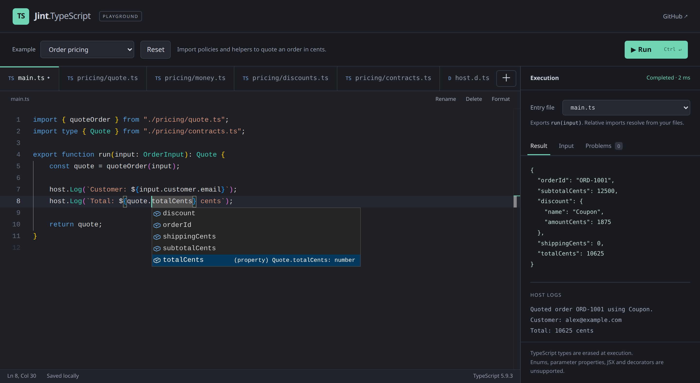

# Jint.TypeScript

Run TypeScript scripts in .NET with Jint. The C# parser is based on [Acornima](https://github.com/adams85/acornima) and requires no Node.js runtime. It erases type syntax while preserving original source locations for errors.

**Experimental:** supports a growing subset of TypeScript on .NET 8 and .NET 10, using Jint 5 preview packages.

Try the [Monaco playground](samples/Jint.TypeScript.Sample/README.md): edit TypeScript files with IntelliSense, import helpers, and run order validation, webhook and pricing examples. Requires Node 22.12+ to build the editor.



```powershell
dotnet run --project samples/Jint.TypeScript.Sample -f net10.0
```

Open [localhost:5178](http://localhost:5178).

## Get started

CI packages use the Foundatio preview feed. Add both feeds to your application's NuGet sources, then install the latest preview:

```powershell
dotnet nuget add source https://f.feedz.io/foundatio/foundatio/nuget/index.json --name Foundatio
dotnet nuget add source https://f.feedz.io/sebastienros/jint/nuget/index.json --name Jint-preview
dotnet add package Jint.TypeScript --prerelease
```

Jint 5 is currently a preview dependency. See [CI packages](docs/ci-packages.md) for build artifacts and feed details.

```csharp
using Jint;
using Jint.TypeScript;

var compiler = new TypeScriptCompiler();
var prepared = compiler.PrepareScript("""
    function add(x: number, y: number): number {
        return x + y;
    }
    add(input, 2);
    """, "rules.ts");

var result = new Engine().SetValue("input", 40).Evaluate(prepared); // 42
```

Cache prepared scripts for repeated execution. The compiler can be shared between threads; Jint engines retain their usual concurrency restrictions. `TypeScriptModuleLoader` loads imports from a directory or virtual files and caches prepared modules.

## TypeScript support

Supported features include:

- Type annotations, aliases, interfaces, unions, tuples, mapped and conditional types.
- Generic functions, arrows, calls, and classes.
- Typed and abstract classes, overload signatures, and selected `declare` declarations.
- `as`, `satisfies`, non-null assertions, and explicit type-only imports and exports.

Types are erased without type checking or runtime validation. Use your editor or `tsc` for type checking.

Enums, namespaces, constructor parameter properties, JSX/TSX, and decorators are not supported. Strings passed to Jint's ordinary execution APIs, `eval`, or `Function` must still be JavaScript.

For enum-like constants, use an [`as const` object and union type](docs/usage.md#unsupported-syntax-and-enum-alternatives).

See the [Acornima comparison](docs/acornima-comparison.md), [usage and syntax reference](docs/usage.md), and [performance measurements](docs/performance.md).

## License

Apache-2.0, with imported components under their respective licenses. See [LICENSE](LICENSE.txt) and [third-party notices](THIRD-PARTY-NOTICES.txt).
